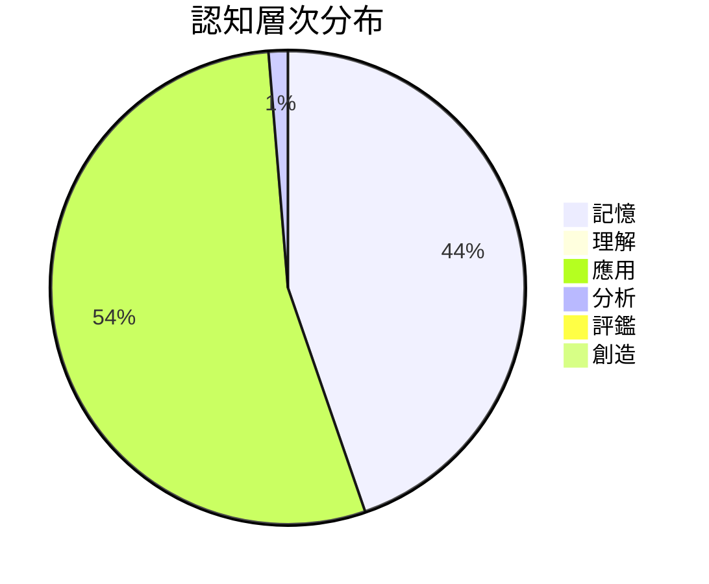

# 認知層次分析報告

> 分析期間：2026-S1 ｜ 分析題數：N = 700
> 產生時間：2026-02-05T23:04:26.089892

---

## 一、為什麼需要這份報告？

### 問題

家長常問：「孩子做了很多題目，但程度有進步嗎？」

單看「做了幾題」無法回答這個問題，因為：
- 100 題簡單的背誦題 ≠ 10 題需要思考的分析題
- 題目的「認知層次」不同，訓練效果也不同

### 這份報告能回答什麼

這份報告分析題庫中各題目的「認知層次」分布，讓家長了解：

1. **題庫的訓練重點在哪裡？** — 偏重記憶，還是偏重思考？
2. **不同國家的考試有什麼差異？** — 台灣、美國、中國的考試各強調什麼能力？
3. **目標考試需要什麼能力？** — 孩子的練習是否對準目標？

---

## 二、什麼是「認知層次」？

我們使用教育學家 Benjamin Bloom 提出的「認知層次分類法」（Bloom's Taxonomy），將題目分為六個層次：

| 層次 | 名稱 | 定義 | 題目範例 |
|------|------|------|----------|
| **1** | 記憶 | 回憶事實、術語 | 「質數的定義是什麼？」 |
| **2** | 理解 | 用自己的話解釋 | 「為什麼 1 不是質數？」 |
| **3** | 應用 | 把知識用在新情境 | 「判斷 97 是否為質數」 |
| **4** | 分析 | 拆解問題、找出關係 | 「比較兩種判斷質數的方法」 |
| **5** | 評鑑 | 判斷對錯、評估優劣 | 「這個證明有沒有漏洞？」 |
| **6** | 創造 | 設計新方法、產生新想法 | 「設計一個更快的質數判斷法」 |

**層次越高，越需要「思考」而非「記憶」。**

---

## 三、分析結果

### 整體分布

題庫分析：53.6% 的題目屬於「apply」層次

| 層次 | 題數 | 佔比 | 說明 |
|------|------|------|------|
| 1. 記憶 | 311 | 44.4% | 考「知不知道」 |
| 2. 理解 | 5 | 0.7% | 考「懂不懂」 |
| 3. 應用 | 375 | 53.6% | 考「會不會用」 |
| 4. 分析 | 9 | 1.3% | 考「能不能拆解」 |
| 5. 評鑑 | 0 | 0.0% | 考「能不能判斷」 |
| 6. 創造 | 0 | 0.0% | 考「能不能發明」 |

### 這個結果代表什麼？

- **記憶層次偏高（44.4%）**：題庫中有大量「背就會」的題目，適合打基礎，但不足以應付需要思考的考試。

- **應用層次為主（53.6%）**：題庫以「計算、解題」為主，這是大多數標準化考試的重點。

- **分析層次偏低（1.3%）**：較少需要「比較、推論」的題目。如果目標是競賽或頂尖大學，可能需要補充更多分析型題目。

---

## 四、跨國比較

不同國家的考試，強調的認知層次不同：

| 國家 | 記憶 | 理解 | 應用 | 分析 | 評鑑 | 創造 | 特色 |
|------|------|------|------|------|------|------|------|

| 美國 | 15% | 20% | 45% | 12% | 5% | 3% | 應用層次為主 |

| 台灣 | 25% | 25% | 35% | 10% | 3% | 2% | 記憶+應用均衡 |

| 中國 | 10% | 15% | 40% | 25% | 7% | 3% | 分析層次最高 |

### 這代表什麼？

- **🇨🇳 中國高考**：分析層次最高（25%），題目常需要「推論」和「判斷不等式方向」，數學抽象程度高。
- **🇺🇸 美國 SAT**：應用層次為主（45%），題目常有生活情境，強調「能不能用」。
- **🇹🇼 台灣學測**：記憶和應用均衡，反映「基礎要穩、也要會算」的教育取向。

---

## 五、各層次範例題目

以下是各層次的實際題目範例，幫助理解分類標準：

### 記憶層次

> **tmmlu_tw**：下列何者為累進稅制的定義？

> **tmmlu_tw**：下列何者是影響某一商品供給的價格彈性的重要因素？

### 理解層次

> **tmmlu_tw**：當經濟體系出現金融市場復甦強勁，但就業市場復甦緩慢的兩極化現象，此稱為什麼型態的復甦？

> **scienceqa**：Does this passage describe the weather or the climate?
There was rain and sleet in Sioux Falls, South Dakota, last weekend.

### 應用層次

> **tmmlu_tw**：寡占市場結構與其他三種類型市場結構之最大差異在於下列何者？

> **tmmlu_tw**：下列關於帝波模型的假設，何者正確？

### 分析層次

> **tmmlu_tw**：下列有關自然獨占廠商效率分析的說明，何者錯誤？

> **tmmlu_tw**：有關成本效益分析方法之運用，下列何者正確？

---

## 六、資料來源與方法

### 資料來源

| 題庫 | 使用題數 | 說明 |
|------|----------|------|

| tmmlu_tw | 200 | |

| sat_math_hf | 200 | |

| gaokao_cn | 100 | |

| scienceqa | 200 | |

### 分類方法

本報告使用「關鍵詞匹配 + 題型判斷」自動分類，準確度約 70-80%。

**已知限制**：
- 部分題目的層次可能被低估（例如：看起來是「計算」，但實際需要「分析」才能找到解法）
- 開放式題目的分類較準確，選擇題的分類可能有誤差

---

## 七、重要說明

本報告基於題庫資料的統計分析：

- ✅ **可以**：了解題庫的整體特性、比較不同來源的題目分布
- ❌ **不能**：評估孩子的能力、提供學習建議

**如需專業教育諮詢，請聯繫教育專業人員。**

---

*本報告由學生學習地圖系統自動產生*