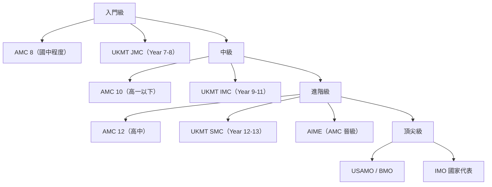
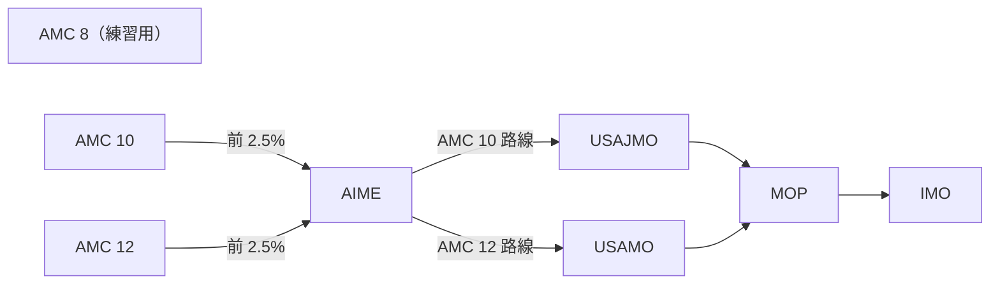
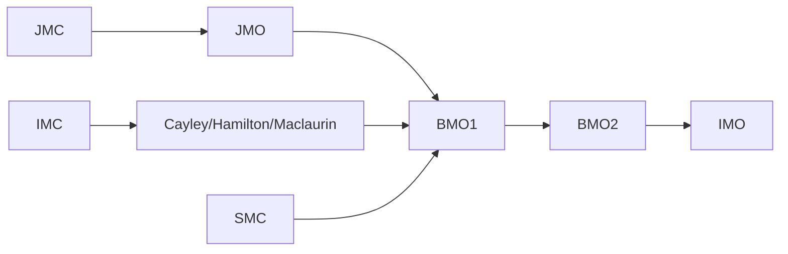

# 數學競賽入門指引

說明「從零開始」準備各級競賽需達到的基本水準。

---

## 競賽難度階梯

---

## 入門級競賽

### AMC 8

| 項目 | 內容 |
|------|------|
| 參賽資格 | Grade 8 或以下 |
| 題數/時間 | 25 題 / 40 分鐘 |
| 前置程度 | [12-15 歲課綱](../Narrator/skill_alignment_map/age-12-15) |

**需掌握的技能**：
- 整數、分數、小數運算
- 一元一次方程式
- 比例與百分比
- 基本幾何（面積、周長、畢氏定理）
- 計數原理
- 邏輯推理

### UKMT JMC

| 項目 | 內容 |
|------|------|
| 參賽資格 | Year 7-8（11-13 歲） |
| 題數/時間 | 25 題 / 60 分鐘 |
| 前置程度 | [12-15 歲課綱](../Narrator/skill_alignment_map/age-12-15) |

---

## 中級競賽

### AMC 10

| 項目 | 內容 |
|------|------|
| 參賽資格 | Grade 10 或以下，未滿 17.5 歲 |
| 題數/時間 | 25 題 / 75 分鐘 |
| 前置程度 | Algebra I + Geometry |

**在 AMC 8 基礎上新增**：
- 二次方程式與因式分解
- 函數概念
- 相似三角形
- 坐標幾何
- 質數與整除性
- 排列組合基礎

→ [AMC/AIME 完整門檻數據](../Narrator/exam_threshold_map/competition/amc-aime)

---

## 進階競賽

### AMC 12

| 項目 | 內容 |
|------|------|
| 參賽資格 | Grade 12 或以下，未滿 19.5 歲 |
| 前置程度 | Algebra II + Trigonometry |

**在 AMC 10 基礎上新增**：
- 三角函數
- 複數
- 數列與級數
- 進階計數
- 模運算

### AIME

| 項目 | 內容 |
|------|------|
| 參賽資格 | AMC 10/12 晉級（前 2.5%） |
| 題數/時間 | 15 題 / 180 分鐘 |
| 特色 | 答案為 000-999 整數，無選擇題 |

---

## 晉級路徑圖

### 美國路線

### 英國路線

---

## 各競賽門檻快速參考

| 競賽 | 入門獎 | 晉級門檻 | 頂尖獎項 |
|------|--------|----------|----------|
| AMC 8 | — | — | 滿分 25 |
| AMC 10 | — | AIME 103-115 分 | USAMO |
| AMC 12 | — | AIME 88-100 分 | USAMO |
| UKMT JMC | 銅獎 72+ | 金獎 100+ | JMO 晉級 |
| UKMT IMC | 銅獎 62+ | 金獎 95+ | Olympiad 晉級 |
| UKMT SMC | 銅獎 51+ | 金獎 80+ | BMO1 晉級 |

→ [UKMT 完整門檻數據](../Narrator/exam_threshold_map/competition/ukmt)

---

## 資料來源

- [MAA AMC](https://maa.org/student-programs/amc/)
- [UKMT](https://www.ukmt.org.uk/)

---

## 重要說明

> **本頁面僅呈現前置條件與門檻資料，不提供學習建議。**
>
> 每個人的學習路徑不同，競賽準備方式因人而異。
